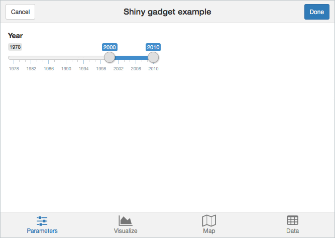

# miniUI

Provides UI widget and layout functions for writing Shiny apps that work well on small screens. Designed to work especially well with Shiny Gadgets.

Inspired by the lovely [Ratchet](http://goratchet.com/) CSS framework, though currently miniUI doesn't use any of Ratchet's CSS code.

### Installing

```r
devtools::install_github("rstudio/miniUI")
```

### Getting started

Check out the [Designing Gadget UI](http://shiny.rstudio.com/articles/gadget-ui.html) article on [shiny.rstudio.com](http://shiny.rstudio.com/).


### Example



```r
ui <- miniPage(
  gadgetTitleBar("Shiny gadget example"),
  miniTabstripPanel(
    miniTabPanel("Parameters", icon = icon("sliders"),
      miniContentPanel(
        sliderInput("year", "Year", 1978, 2010, c(2000, 2010), sep = "")
      )
    ),
    miniTabPanel("Visualize", icon = icon("area-chart"),
      miniContentPanel(
        plotOutput("cars", height = "100%")
      )
    ),
    miniTabPanel("Map", icon = icon("map-o"),
      miniContentPanel(padding = 0,
        leafletOutput("map", height = "100%")
      ),
      miniButtonBlock(
        actionButton("resetMap", "Reset")
      )
    ),
    miniTabPanel("Data", icon = icon("table"),
      miniContentPanel(
        DT::dataTableOutput("table")
      )
    )
  )
)
```

Full source at: https://github.com/rstudio/miniUI/blob/master/examples/tabs.R

---

### Compiling [Less](http://lesscss.org/) source to CSS

**You generally don't need to do this.** This build step is only needed if you want to contribute to the development of the package by modifying the built-in CSS styles.

#### One-time setup

**Prerequisite:** You must have Node.js installed.

```sh
# Install the grunt command if necessary
which grunt || sudo npm install -g grunt-cli

# Install dependencies
cd tools
npm install
```

#### Building

```sh
cd tools
grunt
```
